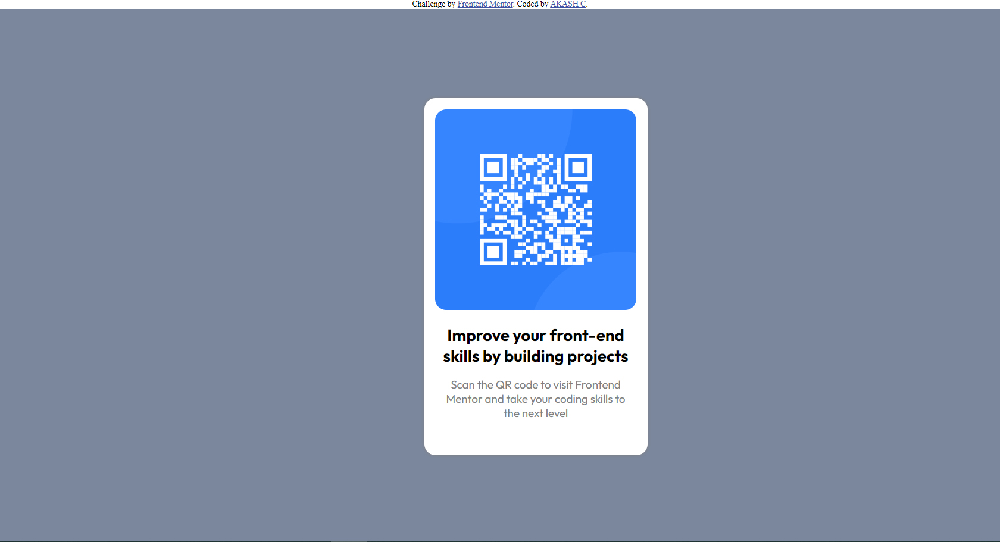

# qrcode

## Table of contents

- [Overview](#overview)
  - [Screenshot](#screenshot)
  - [Links](#links)
- [My process](#my-process)
  - [Built with](#built-with)

## Overview

### Screenshot

### Links

- Live Site URL: [https://ashak0.github.io/qrcode/]

## My process

### Built with

- Semantic HTML5 markup
- CSS custom properties